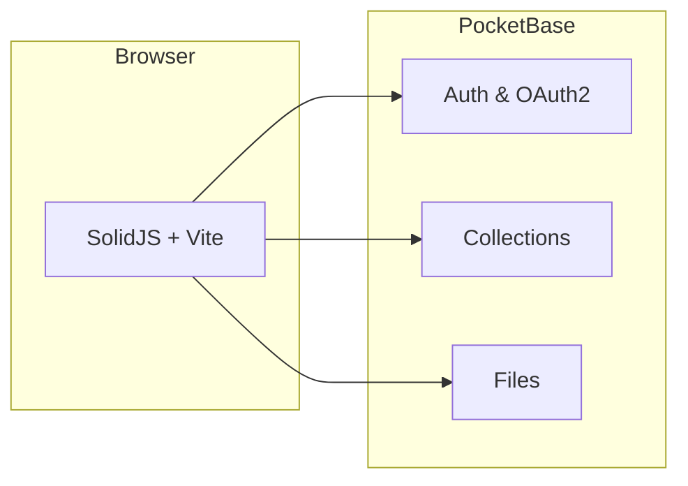

<div align="center">

# CIT Capstone Repository

**Browse, submit, and manage capstone projects** — a full-stack web app for students, faculty, and admins.

[](https://www.solidjs.com/)
[](https://www.typescriptlang.org/)
[](https://vitejs.dev/)
[](https://tailwindcss.com/)
[](https://pocketbase.io/)

[Features](#features) · [Quick start](#quick-start) · [Docs](#documentation) · [Contributing](#contributing)

</div>

---

## About

The **CIT Capstone Repository** is the front end for a capstone catalog backed by **[PocketBase](https://pocketbase.io/)** (auth, REST API, files). Students discover and submit work; faculty review and see analytics; admins manage users, departments, and records.



---

## Features

| Area | What you get |
|------|----------------|
| **Students** | Register (email + OTP), Google sign-in, search & tag filters, capstone detail, PDF download, submit capstone, track approval |
| **Faculty** | Dashboard (search trends, tags, activity charts), approve / reject submissions |
| **Admin** | Users (CRUD, roles, departments), capstones, departments |
| **UX** | Dark mode, PWA-ready, responsive layout |

---

## Tech stack

| Layer | Choice |
|-------|--------|
| UI | [SolidJS](https://www.solidjs.com/) |
| Build | [Vite](https://vitejs.dev/) · TypeScript |
| Styling | [Tailwind CSS](https://tailwindcss.com/) v4 |
| Backend | [PocketBase](https://pocketbase.io/) (single binary) |
| Charts | [Chart.js](https://www.chartjs.org/) |

---

## Prerequisites

- **Node.js** 18+ (20+ recommended)
- **npm** (or pnpm/yarn if you adapt commands)
- **PocketBase** — [download](https://pocketbase.io/docs/) and run locally (or point `.env` to your instance)

---

## Quick start

### 1. Clone & install

```bash
git clone https://github.com/jhzrmx/cit-capstone-repository-pb/
cd cit-capstone-repository-pb
npm install
```

### 2. PocketBase

1. Run PocketBase: `./pocketbase serve` (or `pocketbase.exe serve` on Windows).
2. Open **Admin UI**: [http://127.0.0.1:8090/_/](http://127.0.0.1:8090/_/).
3. **Fast path:** **Settings → Import collections** and import **[`pocketbase_collections_schema.json`](./pocketbase_collections_schema.json)** (creates departments, tags, capstones, search_logs, and extends **users** with `role` + `department`).
4. **Or** follow **[`pocketbase_schema.md`](./pocketbase_schema.md)** manually for collections and API rules.

### 3. Environment

```bash
cp .env.example .env
```

Edit `.env` — see [Environment](#environment) below.

### 4. Run the app

```bash
npm run dev
```

Open **[http://localhost:5173](http://localhost:5173)**.

---

## Environment

| Variable | Required | Description |
|----------|----------|-------------|
| `VITE_POCKETBASE_URL` | Yes* | API base, e.g. `http://127.0.0.1:8090`. **OAuth redirect URIs must match this host** (`127.0.0.1` vs `localhost`). |
| `VITE_OAUTH_PROVIDER` | For Google login | PocketBase OAuth2 provider id, e.g. `google`. |
| `PB_OAUTH_CLIENT_ID` / `PB_OAUTH_CLIENT_SECRET` | Docs only | Configure in PocketBase Admin; values live in PocketBase, not necessarily in Vite. |

\*Defaults in `.env.example` work for local PocketBase.

---

## Scripts

| Command | Description |
|---------|-------------|
| `npm run dev` | Vite dev server (HMR) |
| `npm run build` | `tsc -b` + production bundle |
| `npm run preview` | Serve the production build locally |

---

## Documentation

| Doc | Topic |
|-----|--------|
| [`pocketbase_schema.md`](./pocketbase_schema.md) | Collections & API rules |
| [`docs/OAUTH_SETUP.md`](./docs/OAUTH_SETUP.md) | Google OAuth + PocketBase |
| [`docs/REGISTER_OTP.md`](./docs/REGISTER_OTP.md) | Registration OTP & SMTP |
| [`docs/ADMIN_USER_RULES.md`](./docs/ADMIN_USER_RULES.md) | Admin user API rules |
| [`docs/VERIFIED_API_RULES.md`](./docs/VERIFIED_API_RULES.md) | Verified-email rules |
| [`docs/CAPSTONE_ACCESS.md`](./docs/CAPSTONE_ACCESS.md) | Capstone access / visibility |

---

## Project structure

```
src/
├── components/     # Layout, Modal, SearchBar, TagFilters, CapstoneCard, …
├── pages/          # Routes: Landing, Search, Login, Register, Submit, admin/*, faculty/*
├── services/       # PocketBase clients: auth, capstone, tag, searchLog, …
├── stores/         # authStore, capstoneStore, searchStore, themeStore
├── routes/         # ProtectedRoute, PublicOnlyRoute
└── types/          # Shared TypeScript types
```

---

## Contributing

We’re glad you’re here. Contributions keep this project useful for the community.

### Ways to help

- **Issues** — Bug reports, unclear docs, or feature ideas (use the repo **Issues** tab on GitHub).
- **Pull requests** — Fixes, small UX improvements, docs, or well-scoped features.
- **Docs** — Corrections to README or `/docs` are always welcome.

### Before you PR

1. **Fork** the repo and create a branch: `feat/…`, `fix/…`, or `docs/…`.
2. **Run checks locally**
   ```bash
   npm run build
   ```
   Fix any TypeScript or build errors.
3. **Describe your change** in the PR: what, why, and how to test (e.g. “Login → dark mode toggle”).
4. **Keep PRs focused** — one concern per PR when possible.

### Code style

- **TypeScript** — Prefer typed APIs; avoid `any` unless necessary.
- **Solid** — Fine-grained reactivity; use `createSignal` / `createResource` idiomatically.
- **UI** — Tailwind utilities; follow existing dark-mode patterns (`dark:`) for new surfaces.
- **No secrets** — Never commit `.env` or real OAuth secrets.

### Out of scope (for now)

AI search, recommendations, citations, plagiarism tools, full document versioning — so PRs in those areas may be deferred unless discussed in an issue first.

---

## Scope (summary)

| In scope | Out of scope (current) |
|----------|-------------------------|
| Auth, roles, search, tags, submissions, approvals, admin CRUD, faculty dashboard | AI search, recommendations, plagiarism, versioning |

---

<div align="center">

**Questions?** Start a **Discussion** or **Issue** on GitHub once the repo is public.

Built with SolidJS · Vite · PocketBase

</div>
